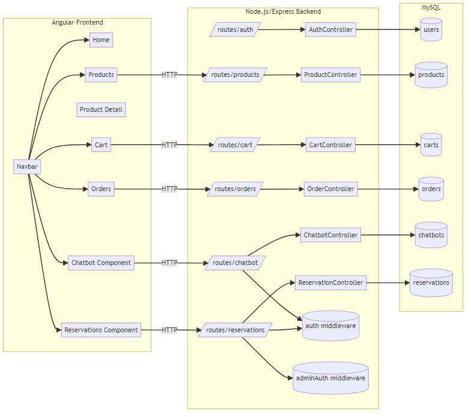
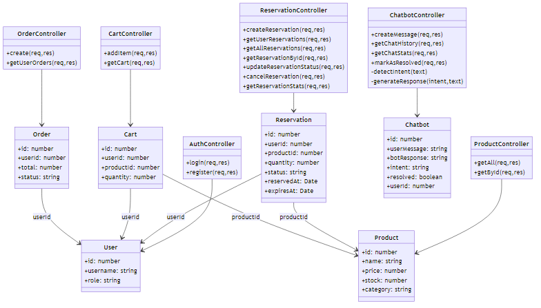
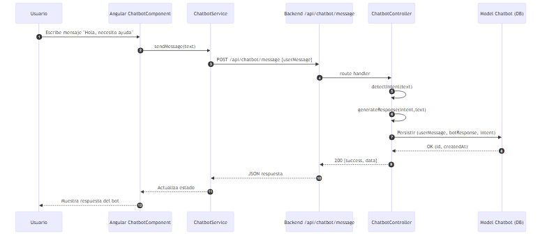
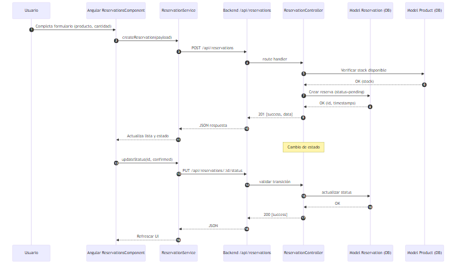
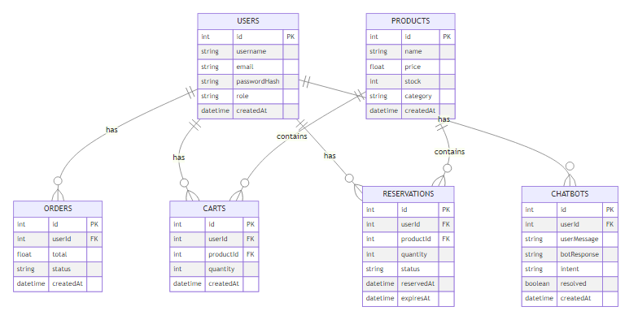

________________________________________
MODELO DE INFORME TÉCNICO PARA PROYECTOS DE DESARROLLO DE SOFTWARE
________________________________________

PORTADA DEL INFORME

NOMBRE DEL PROYECTO: Tienda Sneakers Online (Smash Tenis Store)
INFORME TÉCNICO
Versión 1.0
Empresa / Institución: Proyecto Académico / Personal
Equipo de Desarrollo: Backend + Frontend (Angular/Node.js)
Cliente / Usuario: Usuarios finales del e-commerce
Autor(es): Equipo del proyecto
Fecha: 14/12/2025

________________________________________
HOJA DE CONTROL DE VERSIONES

Versión	Fecha		Autor		Descripción del Cambio
1.0	14/12/2025	Equipo		Versión inicial del informe técnico

________________________________________
ÍNDICE
(En Word → Referencias → Tabla de contenido → Automática)

________________________________________
1. RESUMEN EJECUTIVO
El proyecto "Tienda Sneakers Online" es una plataforma e-commerce para venta de zapatillas, con backend en Node.js/Express y frontend en Angular. Durante esta iteración se añadieron dos módulos clave: Chatbot (asistencia al usuario) y Reservas (gestión de apartados de productos). Se implementaron controladores, modelos, rutas y componentes de UI, además de pruebas unitarias (82 pruebas exitosas). Se verificó el funcionamiento local mediante servidor de prueba y endpoints. La integración de los módulos al frontend quedó completada a nivel de enrutado y navegación. La base de datos MySQL está pendiente de instalación/activación local para pruebas completas de persistencia.

________________________________________
2. INTRODUCCIÓN
2.1 Propósito del documento
Documentar el estado técnico del proyecto, los módulos nuevos incorporados, la arquitectura, metodología, resultados de pruebas y recomendaciones para la siguiente fase.

2.2 Alcance
Cubre el backend (Express) y frontend (Angular), los nuevos módulos de Chatbot y Reservas, configuración de entorno local, calidad y pruebas. No incluye despliegue productivo ni auditorías externas.

2.3 Definiciones y abreviaturas
- API: Interfaz de Programación de Aplicaciones.
- JWT: JSON Web Token, autenticación basada en token.
- ORM: Object-Relational Mapping (Sequelize).
- SQA: Software Quality Assurance.
- UX/UI: Experiencia de usuario / Interfaz de usuario.
- ICP: Cobertura de instrucciones (Statements coverage).

2.4 Referencias
- Normas: ISO 9001, ISO/IEC 25010 (modelo de calidad), IEEE 829 (documentación de pruebas).
- Documentación del proyecto: `README.md`, `GUIA_PRUEBA_LOCAL.md`, `NUEVOS_MODULOS.md`.
- Manuales técnicos: Archivos en `backend/` y `tennis-frontend/`.

________________________________________
3. DESCRIPCIÓN GENERAL DEL PROYECTO
3.1 Contexto
E-commerce con catálogo de productos de tenis, carrito, pedidos, autenticación y administración. Se expande con chatbot y reservas para mejorar atención y conversión.

3.2 Objetivos específicos
- Incorporar un módulo de Chatbot con detección de intención básica.
- Implementar módulo de Reservas con ciclo de vida del estado.
- Integrar frontend (enrutado y navbar) para acceso a nuevos módulos.
- Asegurar pruebas unitarias y guías de pruebas locales.

3.3 Requerimientos clave
- Funcionales: CRUD de reservas, mensajería del chatbot, autenticación JWT, roles admin.
- No funcionales: Seguridad básica de endpoints, rendimiento aceptable, mantenibilidad de código, pruebas automatizadas.

3.4 Restricciones
- Base de datos MySQL pendiente de instalación local.
- Cobertura en nuevos módulos aún baja (se requieren pruebas de integración).
- Tiempo de iteración limitado; CI/CD no configurado.

________________________________________
4. MARCO METODOLÓGICO
4.1 Metodología de desarrollo
Híbrida (Scrum/Kanban): iteraciones cortas, backlog visible, verificación continua por endpoints.

4.2 Artefactos generados
- Historias de usuario (implícitas en `NUEVOS_MODULOS.md`).
- Diagramas: por completar en anexos.
- Prototipos: componentes Angular (chatbot/reservas).
- Código fuente: Controladores, modelos, rutas, servicios y componentes.
- Plan de pruebas: `backend/tests` y guía en `GUIA_PRUEBA_LOCAL.md`.

4.3 Herramientas utilizadas
- IDE: VS Code.
- Repositorio: Git (estructura local).
- CI/CD: Pendiente.
- Analizadores: Jest coverage, nyc; linters configurados según package.json.
- Gestión de proyecto: Manual (documentación y tareas).

________________________________________
5. ANÁLISIS TÉCNICO
5.1 Arquitectura del sistema
Arquitectura MVC en backend (Express) con capas de `controller/`, `model/`, `routes/`, `middleware/`, `config/`. Frontend Angular con componentes standalone y servicios HTTP. Base de datos MySQL (Sequelize) prevista.
Diagrama: ver `docs/diagrams/architecture.md`.
Imagen:

5.2 Diseño del software
- UML: Clases/flujo por complementar.
- Esquema BD: Tablas `users`, `products`, `carts`, `orders`, `chatbots`, `reservations` (ver `GUIA_PRUEBA_LOCAL.md`).
- Modelos lógicos: `Chatbot.js`, `Reservation.js`, más modelos existentes.
Diagramas:
- UML de clases: `docs/diagrams/uml-classes.md`
- Secuencia Chatbot: `docs/diagrams/uml-sequence-chatbot.md`
- Secuencia Reservas: `docs/diagrams/uml-sequence-reservation.md`
- ER de BD: `docs/diagrams/db-schema.md`
Imágenes:

5.3 Tecnologías utilizadas
- Lenguajes: TypeScript (frontend), JavaScript (backend), Python (quality dashboard).
- Frameworks: Angular, Express, Jest, Streamlit.
- Servicios: MySQL (planificado), JWT para auth, Multer para uploads.

________________________________________
6. DESARROLLO DEL PROYECTO
6.1 Cronograma del proyecto
Iteración actual: implementación de módulos + pruebas locales + documentación (diciembre 2025).

6.2 Actividades ejecutadas
- Añadido Chatbot: controlador, modelo, rutas, servicio y componente Angular.
- Añadido Reservas: controlador, modelo, rutas, servicio y componente Angular.
- Integración rutas frontend: `app.routes.ts` y enlaces en `navbar`.
- Pruebas unitarias: 82 tests pasando; cobertura histórica alta en módulos existentes.
- Guías y herramientas: `GUIA_PRUEBA_LOCAL.md`, `quality-assessment/`.

6.3 Riesgos y mitigaciones
- Falta de BD local: usar `test-server.js` para validar endpoints; instalar MySQL.
- Cobertura baja en nuevos módulos: crear pruebas de integración con Supertest y base real.
- Vulnerabilidades npm: ejecutar `npm audit` y remediar dependencias.

________________________________________
7. ASEGURAMIENTO DE LA CALIDAD (SQA)
7.1 Lineamientos de calidad aplicados
Referencias ISO/IEC 25010 y buenas prácticas de testing (Jest), documentación técnica y control de versiones.

7.2 Auditorías de proceso
Checklist interno: estructura MVC, middleware de auth/admin, rutas protegidas, documentación y pruebas.

7.3 Métricas técnicas
Métrica			Resultado	Fuente		Estado
Cobertura (histórica)	ICP 99.5%	nyc/Jest		OK
Funciones (histórica)	100%		nyc/Jest		OK
Ramas (histórica)	91.4%		nyc/Jest		En mejora
Pruebas actuales		82 PASS		Jest			OK
Vulnerabilidades		4
pm audit		Pendiente mitigación

________________________________________
8. PRUEBAS DE SOFTWARE
8.1 Tipos de pruebas realizadas
- Unitarias (Jest) en controladores.
- Verificación manual de endpoints vía PowerShell e HTML test page.
- Carga/rendimiento (k6 tests disponibles).

8.2 Resultados
- 82 pruebas unitarias PASS.
- Endpoints `/api/products` y `/api/chatbot/message` verificados.
- Servidor de prueba sin BD inició y respondió correctamente.

8.3 Evidencias
- Salidas de terminal y respuestas JSON (ver `GUIA_PRUEBA_LOCAL.md` y `backend/test-page.html`).

________________________________________
9. RESULTADOS Y DISCUSIÓN
- Cumplimiento: módulos añadidos y rutas integradas; servidor de prueba funcional.
- Problemas: falta BD local; cobertura de nuevos módulos pendiente; algunas vulnerabilidades npm.
- Impacto: mejoras en atención al usuario y conversión mediante chatbot y reservas.
- Mejora continua: integrar MySQL, ampliar pruebas de integración, endurecer seguridad.

________________________________________
10. CONCLUSIONES
La iteración cumplió objetivos funcionales principales. El sistema es verificable localmente sin BD; la integración de frontend permite navegación a los nuevos módulos. Próximo foco: habilitar persistencia real (MySQL), elevar cobertura de pruebas y preparar CI/CD.

________________________________________
11. RECOMENDACIONES
- Instalar y configurar MySQL; ejecutar esquemas y datos de ejemplo.
- Añadir pruebas de integración/E2E con Supertest y base real.
- Configurar CI/CD (GitHub Actions) con lint + test + coverage gates.
- Ejecutar auditorías de seguridad (npm audit, OWASP ZAP) y parchear vulnerabilidades.
- Documentar UML y arquitectura con diagramas actualizados.

________________________________________
12. ANEXOS
- Código relevante: controladores y rutas de Chatbot/Reservas.
- Diagramas: por agregar.
- Capturas: páginas de prueba y Streamlit dashboard.
- Logs: ejecuciones de pruebas y servidor.
- Formatos: `.env.example`, guías y referencias.
Referencias a diagramas:
- `docs/diagrams/architecture.md`
- `docs/diagrams/uml-classes.md`
- `docs/diagrams/uml-sequence-chatbot.md`
- `docs/diagrams/uml-sequence-reservation.md`
- `docs/diagrams/db-schema.md`
