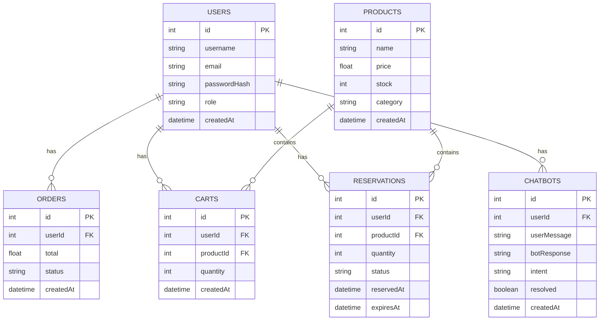

# Esquema de Base de Datos (ER)

```mermaid
erDiagram
    USERS {
        int id PK
        string username
        string email
        string passwordHash
        string role
        datetime createdAt
    }
    PRODUCTS {
        int id PK
        string name
        float price
        int stock
        string category
        datetime createdAt
    }
    CARTS {
        int id PK
        int userId FK
        int productId FK
        int quantity
        datetime createdAt
    }
    ORDERS {
        int id PK
        int userId FK
        float total
        string status
        datetime createdAt
    }
    CHATBOTS {
        int id PK
        int userId FK
        string userMessage
        string botResponse
        string intent
        boolean resolved
        datetime createdAt
    }
    RESERVATIONS {
        int id PK
        int userId FK
        int productId FK
        int quantity
        string status
        datetime reservedAt
        datetime expiresAt
    }

    USERS ||--o{ ORDERS : has
    USERS ||--o{ CARTS : has
    USERS ||--o{ RESERVATIONS : has
    USERS ||--o{ CHATBOTS : has

    PRODUCTS ||--o{ CARTS : contains
    PRODUCTS ||--o{ RESERVATIONS : contains
```
