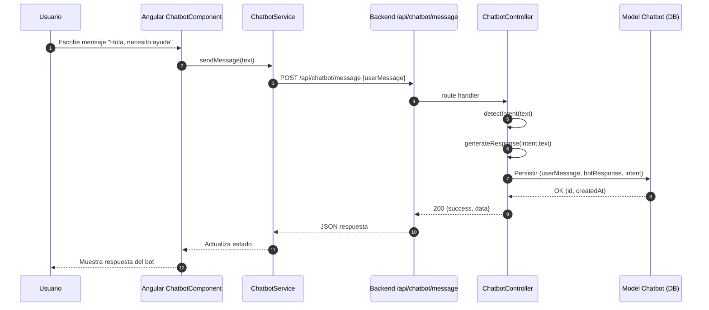

# Secuencia: Mensaje de Chatbot

```mermaid
sequenceDiagram
    autonumber
    participant U as Usuario
    participant AC as Angular ChatbotComponent
    participant CS as ChatbotService
    participant API as Backend /api/chatbot/message
    participant CC as ChatbotController
    participant M as Model Chatbot (DB)

    U->>AC: Escribe mensaje "Hola, necesito ayuda"
    AC->>CS: sendMessage(text)
    CS->>API: POST /api/chatbot/message {userMessage}
    API->>CC: route handler
    CC->>CC: detectIntent(text)
    CC->>CC: generateResponse(intent,text)
    CC->>M: Persistir (userMessage, botResponse, intent)
    M-->>CC: OK (id, createdAt)
    CC-->>API: 200 {success, data}
    API-->>CS: JSON respuesta
    CS-->>AC: Actualiza estado
    AC-->>U: Muestra respuesta del bot
```
