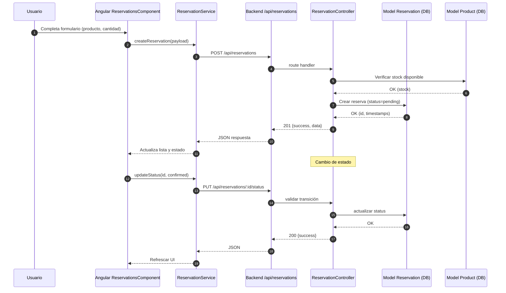

# Secuencia: Flujo de Reserva

```mermaid
sequenceDiagram
    autonumber
    participant U as Usuario
    participant RC as Angular ReservationsComponent
    participant RS as ReservationService
    participant API as Backend /api/reservations
    participant RCt as ReservationController
    participant R as Model Reservation (DB)
    participant P as Model Product (DB)

    U->>RC: Completa formulario (producto, cantidad)
    RC->>RS: createReservation(payload)
    RS->>API: POST /api/reservations
    API->>RCt: route handler
    RCt->>P: Verificar stock disponible
    P-->>RCt: OK (stock)
    RCt->>R: Crear reserva (status=pending)
    R-->>RCt: OK (id, timestamps)
    RCt-->>API: 201 {success, data}
    API-->>RS: JSON respuesta
    RS-->>RC: Actualiza lista y estado

    Note over RCt: Cambio de estado
    RC->>RS: updateStatus(id, confirmed)
    RS->>API: PUT /api/reservations/:id/status
    API->>RCt: validar transición
    RCt->>R: actualizar status
    R-->>RCt: OK
    RCt-->>API: 200 {success}
    API-->>RS: JSON
    RS-->>RC: Refrescar UI
```
